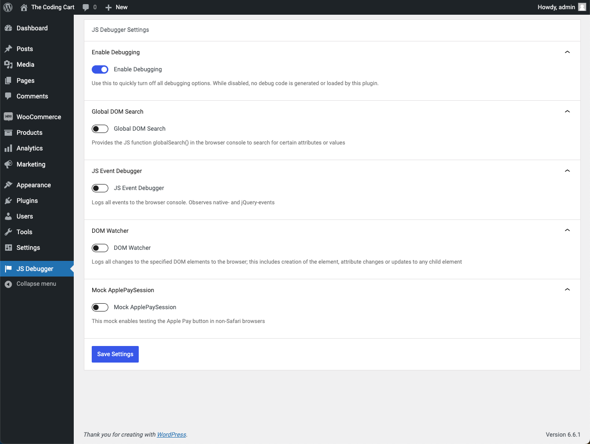

# WP JS Debugger

Debugging plugin to analyze JS behavior on a WordPress site.

## Usage

1. Install and activate the plugin.
2. Visit `wp-admin → JS Debugger` and enable individual debug modules.
3. Inspect the JS console of the browser to see details about JS events.

### Modules



<details>
<summary><strong>Enable Debugging</strong></summary>

Globally enable or disable debug options. When disabled, the original HTML output is not modified and no debug scripts are loaded.

---

</details>

<details>
<summary><strong>Global DOM search</strong></summary>

In the JS console, use the new function `globalSearch()` to find JS data in any object.

```js
// Search entire DOM document for the string value.
globalSearch( document, 'someValue' );

// Simple regex search (function recognizes prefix/suffix patterns: "^..." or "...$").
globalSearch( document, '^start' );

// Advanced Regex search.
globalSearch( document, new Regex('[a|b]') );

// Searches all keys with the name "value" inside the object window.myObj
globalSearch( 'myObj', 'value', 'key' );

// Ends the search after 3 results were found.
globalSearch( window, 'value', 'key', 3 );

// Finds the first three occurances of "value" in either an object key or value.
globalSearch( window, 'value', 'all', 3 );
```

---

</details>

<details>
<summary><strong>JS Event Debugger</strong></summary>

When enabled, JS event actions are logged to the browsers console:

- Add event listener
- Remove event listener
- Dispatched events

The module monitors native JS events, as well as jQuery events.

Optionally, a list of ignored events can be defined to keep the console output a bit cleaner.

---

</details>

<details>
<summary><strong>DOM Watcher</strong></summary>

When enabled, a MutationObserver monitors all events that modify the specified DOM elements. This module requires at least one selector of an element to watch, otherwise it's useless.

Whenever the element is modified, a console log is generated. Optionally, a `debugger` breakpoint can fire to pause the script execution.

---

</details>

<details>
<summary><strong>Mock ApplePaySession</strong></summary>

Simulates the ApplePaySession API, which is built into Safari browsers and is required for the Apple Pay button to render in the browser. When enabled, Apple Pay buttons are rendered in all browsers.

Note, that the Apple Pay button displays a debug notification, when clicked in a non-Safari browser.

---

</details>


## Changelog

- 1.1.0
  - New: Settings page to enable or disable individual debug features.
  - New: Option to mock the ApplePaySession API to test Apple Pay in any browser.
  - Fix: Check to prevent double initialization of debug modules, fixing duplicate console log output.
- 1.0.2
  - New: Add a global JS search function, from this Gist: <https://gist.github.com/stracker-phil/e5b3bbd5d5eb4ffb2acdcda90d8bd04f>
- 1.0.1
  - Improve: Move debugging script to a JS file instead of using an inline script.
  - Fix: The debugging script is now also loaded on wp-admin.
- 1.0.0
  - Initial version.
